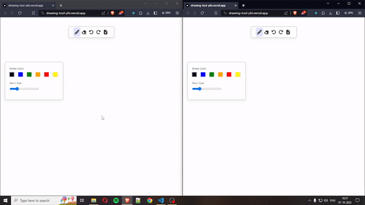

# Drawing Tool 🎨✍️


A versatile and interactive drawing tool crafted with passion. Dive in to explore, draw, and express your creativity digitally!
Leverage our web application, meticulously engineered using Next.js and Node.js, to collaborate seamlessly with colleagues worldwide. By accessing the identical link in a distinct browser tab, all drawing, erasure, undo, and redo actions synchronize in real-time, ensuring a unified experience for all participants.



## 🌐 **Live Demo**: [Drawing Tool](https://drawing-tool-phi.vercel.app/)

## Features 🌟

- **Freestyle Drawing**: Unleash your creativity with freehand drawing.
- **Color Palette**: Choose from a range of colors.
- **Easy Undo/Redo**: Made a mistake? Just undo it with a single click.
- **Export Options**: Save your masterpieces in JPEG formats.
- **Only Desktop/Laptop**: Works beautifully on desktop/laptops.

## 🛠️ **Tech Stack**

Drawing Tool is built with the power and simplicity of several leading technologies:

- **Frontend**:
  -  React.js: A JavaScript library for building user interfaces.
  -  Next.js: A React framework for server-rendered applications.

- **Backend**:
  -  Node.js: A JavaScript runtime built on Chrome's V8 engine.
  -  Express.js: A minimal and flexible Node.js web application framework.

- **Styling and UI**:
  -  Styled Components: Visual primitives for component-centric styling.
  
- **Deployment**:
  -  Vercel: A platform optimized for frontend and serverless deployment.

- **Other**:
  - Tools like WebSockets, Canvas API, etc.

## Table of Contents

- [Installation](#installation)
- [Usage](#usage)
- [Contributing](#contributing)
- [Server](#server)

## Installation 📦

1. Clone the repository:
   ```bash
   git clone https://github.com/9Yogesh9/drawing_tool.git
   ```

2. Navigate to the project directory:
   ```bash
   cd drawing_tool
   ```

3. Install the required dependencies:
   ```bash
   npm install
   ```

4. Start the application:
   ```bash
   npm start
   ```

## Usage 🖌️

1. Open the application in your browser.
2. Open the same application in another browser tab.
3. Choose a tool from the toolbar.
4. Select a color from the palette.
5. Start drawing on the canvas.
6. All of your actions will be in sync across the browser tabs. Enjoy!

## Server configurations 📡 : [Server Link](https://github.com/9Yogesh9/drawing_tool_server)

The server for this app is configured in node.js and will be needed to get the activites in sync across all instances. Please check out : https://github.com/9Yogesh9/drawing_tool_server

## Contributing 🤝

We welcome contributions from everyone.

1. Fork the repository.
2. Create a new branch.
3. Make your changes.
4. Submit a pull request!
